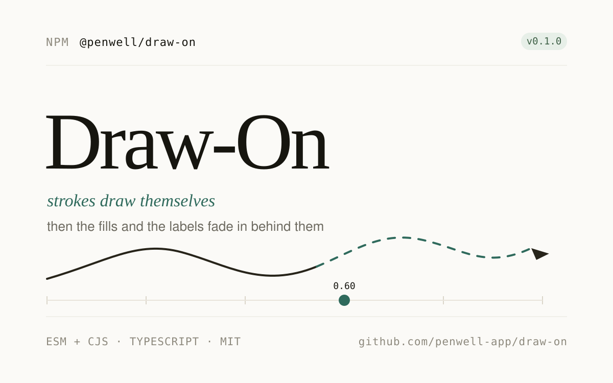

<div align="center">
  
  <h1>@penwell/draw-on - Basic Visualization Demo</h1>
</div>

A comprehensive demonstration of `@penwell/draw-on` showcasing all major features including the core API, React hooks, scrubbing controls, and WebM recording capabilities.

## 🎯 What This Demo Shows

This demo application demonstrates:

- **Core API Usage**: Direct manipulation of SVG drawing animations using `createDrawing`
- **React Integration**: Using the `useSketchDraw` hook for reactive animations
- **Progress Scrubbing**: Real-time control over animation progress with range sliders
- **WebM Recording**: Browser-based video export of SVG animations
- **Multiple SVG Types**: Basic shapes and complex diagrams with fills, strokes, and text

## 🚀 Features Demonstrated

### 1. Basic Drawing
- Simple SVG path animation
- Stroke-by-stroke drawing
- Circle fills and text reveals

### 2. Styled Diagrams
- Complex diagrams with multiple elements
- Shadows and filters
- Coordinated fill and label animations

### 3. React Hook
- `useSketchDraw` hook implementation
- State management for animation status
- Integrated playback controls

### 4. WebM Recording
- Browser-based video recording
- Progress tracking during export
- Automatic download of recorded animations
- Browser compatibility detection

## 📦 Installation

```bash
npm install
```

## 🏃 Running the Demo

Development server:
```bash
npm run dev
```

Build for production:
```bash
npm run build
```

Preview production build:
```bash
npm run preview
```

## 💡 Key Code Examples

### Using the Core API
```typescript
import { createDrawing, parseSvg } from '@penwell/draw-on';

const svg = parseSvg(svgMarkup);
const drawing = createDrawing(svg, { duration: 220 });
drawing.play();
drawing.setProgress(0.5); // Scrub to 50%
```

### Using the React Hook
```typescript
import { useSketchDraw } from '@penwell/draw-on';

const { containerRef, status, play, setProgress } = useSketchDraw({
  svgMarkup: DIAGRAM_SVG,
  duration: 260,
});
```

### Recording to WebM
```typescript
import { recordDrawToWebM, computeDims, downloadBlob } from '@penwell/draw-on';

const { width, height } = computeDims(drawing.el);
const blob = await recordDrawToWebM(drawing.el, drawing.setProgress, {
  width,
  height,
  fps: 30,
  durationMs: 4200,
  background: '#fffdf7',
});
downloadBlob(blob, 'animation.webm');
```

## 🛠 Tech Stack

- **React 18** with TypeScript
- **Vite** for fast development and building
- **@penwell/draw-on** for SVG animations
- **ESLint** for code quality

## 📖 Learn More

- [npm Package](https://www.npmjs.com/package/@penwell/draw-on)
- [GitHub Repository](https://github.com/penwell-app/draw-on)
- [Documentation](https://github.com/penwell-app/draw-on#readme)

## 🎨 Customization

The demo includes custom styling in `src/App.css` and `src/styles.css`. You can modify:
- Color schemes
- Animation durations
- SVG content
- Layout and typography

## ⚠️ Browser Compatibility

WebM recording requires:
- `MediaRecorder` API support
- `canvas.captureStream()` support

Best support in Chromium-based browsers (Chrome, Edge, Brave).

## 📄 License

MIT © 2026 Pratik Singh
